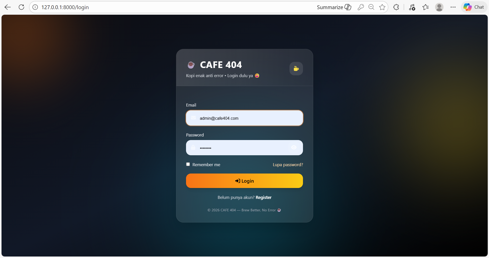
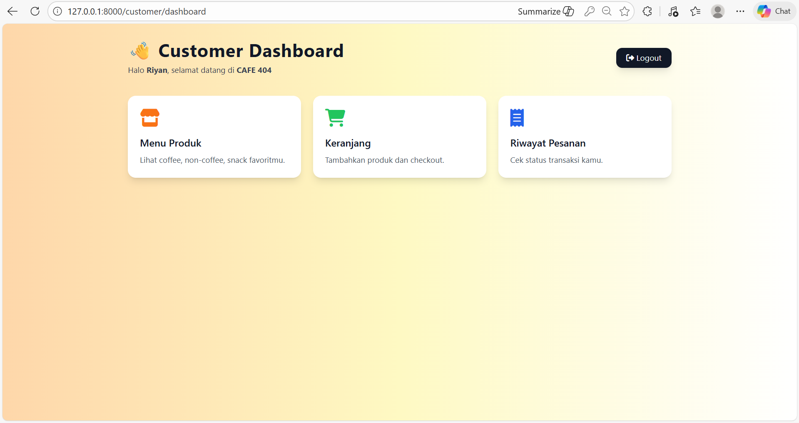

# ☕ CAFE 404


Aplikasi Coffee Shop berbasis **Laravel** dengan 2 role utama:

- ✅ **Admin** (Dashboard admin + kelola produk + kelola pesanan + laporan)
- ✅ **Customer** (Dashboard customer + menu + keranjang + checkout + riwayat pesanan)

---

## 📸 Preview UI

### 🔐 Login Page


### 🛠️ Admin Dashboard


### 👤 Customer Dashboard


---

## 🚀 Fitur Utama

### ✅ Customer
- Login & Register (UI custom CAFE 404)
- Lihat menu produk (Coffee / Non-Coffee / Snack)
- Search & filter kategori
- Tambah produk ke keranjang (Session Cart)
- Checkout + pilih metode pembayaran
- Riwayat pesanan + detail pesanan

### ✅ Admin
- Dashboard admin
- CRUD Produk (Tambah / Edit / Hapus)
- Kelola pesanan customer
- Update status pesanan: `pending`, `paid`, `cancelled`
- Laporan penjualan + filter tanggal + chart sederhana

---

## 💳 Metode Pembayaran (Simulasi)

Saat checkout, customer dapat memilih metode pembayaran:

- Bank Transfer: **BCA, Mandiri, BRI, BNI**
- Dompet Digital: **DANA, GO-PAY, ShopeePay**
- QR Code: **QRIS**

> Pembayaran masih simulasi (belum payment gateway).  
> Order disimpan dengan status default `pending`.

---

## 🔑 Akun Admin (Seeder)

Admin otomatis dibuat melalui seeder.

✅ **Admin Login**
- Email: `admin@cafe404.com`
- Password: `admin404`

---

## 🛠️ Teknologi
- Laravel
- MySQL (Laragon + phpMyAdmin)
- TailwindCSS (CDN)
- Font Awesome Icons
- Chart.js (laporan admin)

---

## 🗄️ Database

Project ini menggunakan **MySQL**.

✅ Nama database yang digunakan:
- `cafe404_db`

✅ Tabel utama:
- `users`
- `categories`
- `products`
- `orders`
- `order_items`
- `sessions`

Database dibuat otomatis menggunakan **migration**, dan data awal dibuat oleh **seeder**.

---

## ⚙️ Cara Install & Jalankan Project (Local)

### 1) Clone Repository
```bash
git clone https://github.com/USERNAME/REPO_NAME.git
cd REPO_NAME
```

### 2) Install Dependencies
```bash
composer install
npm install
```

### 3) Copy ENV
```bash
Linux/Mac:

cp .env.example .env


Windows:

copy .env.example .env
```

### 4) Generate APP KEY
```bash
php artisan key:generate
```

## ⚙️ Setup Database (Laragon + phpMyAdmin)

### 5) Buat Database

Buka http://localhost/phpmyadmin

Klik New

Buat database dengan nama: cafe404_db

Collation: utf8mb4_unicode_ci

### 6) Setting .env
```bash
Buka file .env, lalu sesuaikan:

DB_CONNECTION=mysql
DB_HOST=127.0.0.1
DB_PORT=3306
DB_DATABASE=cafe404_db
DB_USERNAME=root
DB_PASSWORD=
```

### 7) Migrate + Seed
```bash
php artisan migrate:fresh --seed
```

Seeder akan mengisi:

akun admin

kategori (coffee / non-coffee / snack)

produk awal

▶️ Menjalankan Project

### 8) Jalankan Backend Laravel
```bash
php artisan serve
```

Akses:

http://127.0.0.1:8000

### 9) Jalankan Frontend (Vite)
```bash

Mode development:

npm run dev


Build production:

npm run build
```

### 🌐 URL Penting

✅ Login: http://127.0.0.1:8000/login

✅ Register: http://127.0.0.1:8000/register

✅ Customer Dashboard: http://127.0.0.1:8000/customer/dashboard

✅ Admin Dashboard: http://127.0.0.1:8000/admin/dashboard

✅ Menu Customer: http://127.0.0.1:8000/menu

✅ Keranjang: http://127.0.0.1:8000/cart

✅ Checkout: http://127.0.0.1:8000/checkout

✅ Admin Orders: http://127.0.0.1:8000/admin/orders

✅ Admin Reports: http://127.0.0.1:8000/admin/reports

### 📌 Catatan Penting

Folder vendor/ dan node_modules/ tidak diupload ke GitHub (best practice).

File .env tidak diupload karena berisi konfigurasi sensitif.

Produk belum menggunakan gambar (sementara).

### 🧰 Troubleshooting
Error: Table 'sessions' doesn't exist
```bash
php artisan session:table
php artisan migrate
```

Error: Duplicate entry admin@cafe404.com
```bash
php artisan migrate:fresh --seed
```

### 📄 License

Project ini dibuat untuk pembelajaran & portofolio.